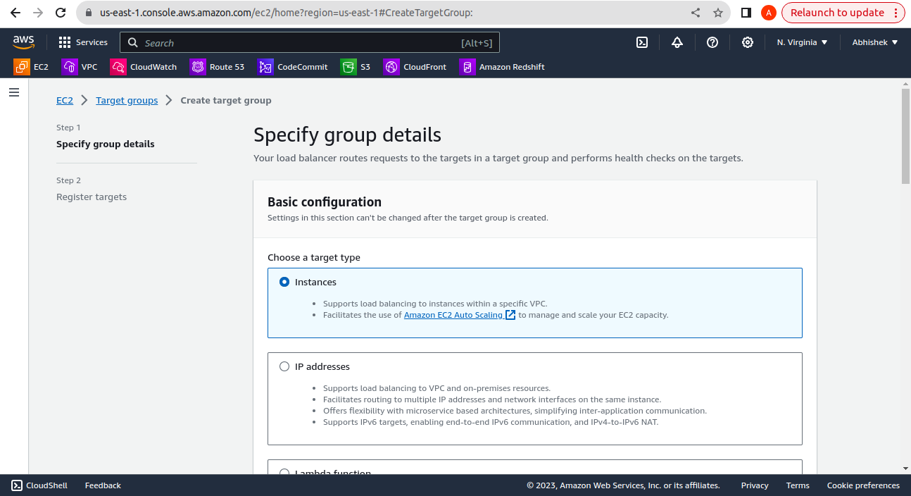
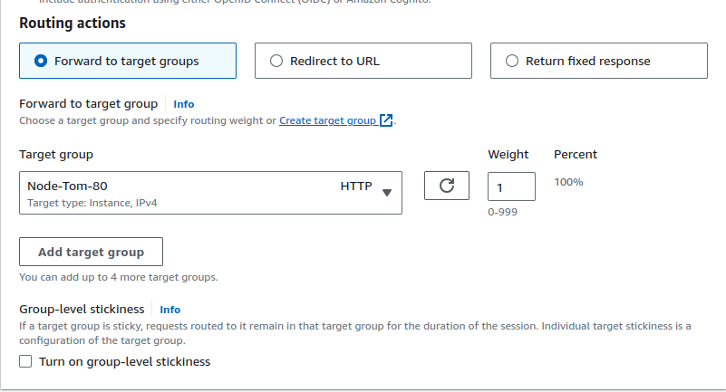

# AWS Application Load Balancer

| Revision | Change | Date | Author | Approver |
| --- | --- | --- | --- | --- |
| 0.1 | Initial Release |  | Abhishek S. | Shoaib S. |

---

## Objective

We will look how to Create AWS Load balancer, Overview and steps to create ALB To route request to Ec2 Instance where application is of Nodejs and FE is running on Port 80 and Backend on Port 3000 and Database is RDS

## Overview 
AWS Application Load balancer works on L7 of OSI (Open system Intercommunication) Model, It is similar to Nginx. It is commonly used for Host/Domain based and Path based routing and It is regional service.

#### Steps to create Load Balancer 

- Create Target Groups.
  ###### Oveview: Target groups route requests to individual registered targets, such as EC2 instances, using the protocol and port number that you specify. You can register a target with multiple target groups. You can configure health checks on a per target group basis.Health checks are performed on all targets registered to a target group that is specified in a listener rule for your load balancer.
   
- Search Target groups in search box.

- Click on Create Target Groups choose  target type as instance

-  Give the Target Group name, Protocol and Port Health checks and also give VPC Name where your Targets exists (Ec2) 
  

Target Groups: It route requests to individual registered targets, such as EC2 instances, using the protocol and port number that you specify

Health Checks: Application Load Balancer periodically sends requests to its registered targets to test their status. These tests are called health checks

NOTE: We have to create 2 target goups for protocol http and port 80 & 3000 because frontend is on 80 and nodejs backend is running on 3000.

#### Create Application Load balancer 

-  Search Load balancer and select application Load Balancer 

- Give Load Balancer Name > Select scheme as Internet facing for Public Load Balancer > Click on VPC and Availability zone for High Availability 

- Create Security Group for Application Load Balancer for port 80 & 443 for accepting request from that port 

- LISTENER: A listener is a process that checks for connection requests using the port and protocol you configure from client. Below image shows when request comes to listener to port 80 and Protocol Http route to Node-80 Target group and 443 to Node-3000 Target group i.e for backend nodejs application.

- Then After select to create Load Balancer

- RULES: Rules are associated with listeners and define how incoming requests should be processed and routed to specific target groups.
Each listener can have multiple rules. These rules are evaluated sequentially, and when a condition in a rule is met, the associated action is executed.

- For configuring click on load balancer >  click on Listerner > Manage rules > Edit ruled > Add rule > Give Names and Tags as show below.

- Now we will configure rule for Listener for port 80 and Protocol Http in our case name of Listener is Http:80 as show in Above image.
- Our rules for Http:80 says if request from client on port 80 and protocol Http redirect to 443 same as redirection rule in nginx configuration file.

- Below image show that when listener recieves traffic on port 80 with protocol Http with HostHeader www.asghost.cloud redirect to Https protocol to port 443. It is like condition which comes under rules and there are various conditions

- Below image shows conditions and Actions

- Similarly create rule for second Listerner of  protocol Https and port 443 with HostHeader backend.asghost.cloud to forward to target groups Node-3000 where are backend application of nodejs is running.Also create rule in 443 listener that if any request from come frontend in our case https://www.asghost.cloud forward to target group with port 80

- Below image show the conditions for https protocol and port 443 
  
  
  

- In short we will create 1 Rule  For Listener 80 For directing Url from Http(80) to Https(443) and Total there will be 2 Rule in which there is default 1 Rule create by AWS
!

- And For Listener 443 we create 2 Rule and Default 1 rule will be there Therefore there will be Total 3 Rule for Listener 443 

  server {
    
    listen 80;
    server_name https://www.asghost.cloud;
    return 301 https://$host$request_uri;  # Redirect HTTP to HTTPS
}

- Above nginx configuration Shows that my Frontend application is running on port 80 so that i have to create Target group for 80 in ALB
- Also 2 line tells about the redirection from Http to Https..So similar configuration i have make in Listener 80 to redirect to https Refer !

server {
        listen       443 ssl;
        server_name  backend.asghost.cloud;

            # SSL Config Starts here.
            ssl_certificate /etc/letsencrypt/live/asghost.cloud/fullchain.pem;
            ssl_certificate_key /etc/letsencrypt/live/asghost.cloud/privkey.pem;
           # include /etc/letsencrypt/options-ssl-nginx.conf;
            # ssl_dhparam /etc/letsencrypt/ssl-dhparams.pem;

        access_log off;

        location / {
            proxy_pass         http://localhost:3000;
            proxy_redirect      http://localhost:3000 https://backend.asghost.cloud;
            proxy_http_version 1.1;
            proxy_set_header   Host             $host;
            proxy_set_header   X-Real-IP        $remote_addr;
            proxy_set_header   X-Forwarded-For  $proxy_add_x_forwarded_for;
            proxy_set_header   X-Forwarded-Proto https;
            proxy_set_header   X-Forwarded-Host backend.asghost.cloud;
            proxy_max_temp_file_size 0;

            proxy_connect_timeout      150;
            proxy_send_timeout         100;
            proxy_read_timeout         100;

            proxy_buffer_size          8k;
            proxy_buffers              4 32k;
            proxy_busy_buffers_size    64k;
            proxy_temp_file_write_size 64k;

        }
    }

- Above configuration is of reverse proxy to port 3000 i.e to my backend application. So in my ALB i have to create Target Group for port 3000 and in ALB i to have create Listener 443 which route traffic to target group of 3000 and redirections of frontend https url to target group of 80 
Refer 